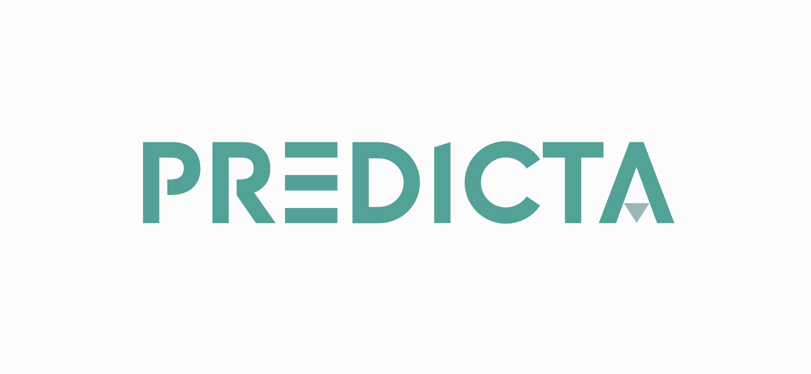

 

## Background

This project was initiated with the primary objective of empowering home resources with an advanced security solution tailored for home networks.
In an era where the number of connected devices within homes is rapidly increasing, ensuring the security and privacy of our digital spaces has become paramount.
This project aims to provide users with a comprehensive security monitoring system that leverages the capabilities of network intrusion detection, device anomaly detection, and real-time alerts.

## Description

**Predicta** is a NID (Network Intrusion Detection) system that leverages ML algorithms to learn "good" (non-malicious) 
and "bad" (malicious) network connections and activity. The ML algorithms is trained on the methodology of supervised
learning with multiple datasets (full list can be found below).

## Features

### Network Intrusion Detection

Capture and analyze network traffic for potential intrusions. Apply custom rules or algorithms to identify suspicious patterns.

### Device Anomaly Detection

Utilize machine learning to learn normal behavior of devices on the network. Raise alerts when anomalies, deviations from the norm, are detected.

### Real-time Alerts

Send real-time alerts through email or phone when security threats or anomalies are identified. Configure notification preferences for timely response.

## Usage

TODO:

## Datasets

Each of the datasets mentioned below was used to create the ML algorithm and apply learning technique in order for it
to make proper predictions.

- **KDD’99**
- **NSL-KDD**
- **UNSW-Nb15**
- **CICIDS2017**

## Authors and maintainers

- Stamencho Bogdanovski: [stamencho.bogdanovski@gmail.com](mailto:stamencho.bogdanovski@gmail.com)

## License

This project is licensed under the terms of the [MIT](https://en.wikipedia.org/wiki/MIT_License) open source license. 
Please refer to [LICENSE](LICENSE) for the full terms.